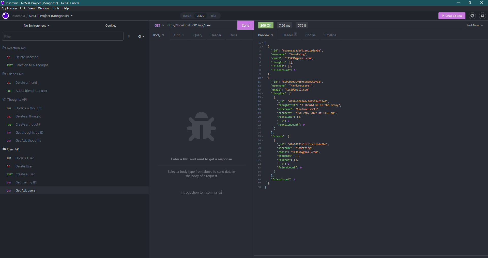

# Basic Social Media API

## Table of Content

- [About The Project](#about-the-project)
- [Getting Started](#getting-started)
- [Usage](#usage)
- [Questions](#questions)
- [Author](#author)

https://youtu.be/RSqoV2vmTFE

## About the Project

This project is a basic social media API. It is built on top of mongoose and express and it contains the bare minimum to make something useful. It will be helpful for beginners who want to learn how to use these two packages together.

Overall, the basic of this project is to be a tool that will allow developers to easily create their own APIs. It’s designed to be simple and easy to use so that developers can spend less time on the underlying infrastructure and more time focusing on what they do best, developing applications.

# Getting Start

Step 1) Install Node

```
    npm init
```

Step 2) Install the packages

```
    npm i express mongoose nodemon
```

Step 3) Run the server

```
    nodemon server.js
```

## Usage

This project is to set up a very basic foundation for a social media API. It is designed to be able to handle the most common social media API requests: get, post, delete, and list.

The project will have three main files: server.js, index.js, and package.json. The server file will contain the code that sets up the API for the client, while index files will contain all of our routes and functions that we can call on those routes. The package file will contain all of our dependencies that are needed for this API to work correctly.

## Questions

If you have any questions about the repo, open an issue or contact me directly at andrewbanagas40@gmail.com. You can find more of my work at [drew990](https://github.com/drew990/)

## Author

Andrew Banagas
